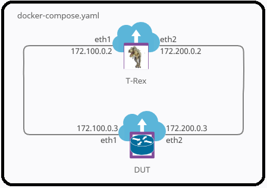

# docker-trex

A simple example setup in Docker to explore Cisco's TRex Packet Generator:  
- TRex Links:
  - [Main Website](https://trex-tgn.cisco.com/)
  - [GitHub Repository](https://github.com/cisco-system-traffic-generator/trex-core)
  - [Cisco DevNet](https://developer.cisco.com/codeexchange/github/repo/cisco-system-traffic-generator/trex-core/)

## The Setup



## Requirements

- [Docker (20.04+)](https://docs.docker.com/get-docker/)
- [Docker Compose (1.27+)](https://docs.docker.com/compose/install/)

## Usage

- Clone the repo

  ```bash
  git clone https://github.com/datmanslo/docker-trex.git
  ```

- Bring up the services

  ```bash
  # Go to the directory containing the cloned repository 
  cd docker-trex
  
  # Bring up the trex and dut services in the background
  docker-compose up -d
  
  # Verify successful startup
  docker-compose ps -a
  ```

- Interact with TRex container
  
  ```bash
  docker-compose exec trex /bin/bash
  ```

## Example interactive session

  This example shows a quick interactive test of an "IMIX" traffic profile included with TRex. *NOTE: These commandds can be completed after bringing up the services in the background via the previous "Bring up the services" step.*

  ```bash
  # Launch a shell inside the trex container
  docker-compose exec trex /bin/bash

  # Start the interactive trex console which will make a local connection to the running interactive daemon
  ./trex-console

  # Start generating some traffic
  start -f stl/imix.py

  # To interact with and view statistics for the current stream launch the text-based user interface (tui)
  tui

  # Attempt to increase per interface traffic rate to 200mbps (400mbps rx/tx total). Throughput achievable in the Docker environment is dependent primarily on single core\thread CPU performance.
  update -m 200mbps
  ```

  

## Notes

- The TRex container is launched with the interactive daemon via the docker-compose command parameter: `command: ["./t-rex-64", "-i", "--cfg", "/etc/trex_cfg.yaml"]`. Feel free to modify this as needed for your needs/experimentation. This is also the default `CMD` in the [Dockerfile](trex.Dockerfile). It is possible to connect to this daemon via various api clients as well as the [TRex Stateless GUI application](https://github.com/cisco-system-traffic-generator/trex-stateless-gui)

- Please see the official [TRex documentation](https://trex-tgn.cisco.com/trex/doc/index.html) for detailed usage and guidance
- The Device Under Test (DUT) is a simple Alpine container with IP forwarding enabled and the iproute2 package installed the command parameter in the Dockerfile sets up the routes for forwarding traffic from the default networks in the TRex traffic profiles:

  ```yaml
    command:
      - sh 
      - -c
      - | 
        ip route add 16.0.0.0/8 via 172.100.0.2
        ip route add 48.0.0.0/8 via 172.200.0.2
        exec sh
  ```

- Each service is setup to run as privileged containers. If security is a concern please remove and modify with the necessary `CAP_ADD` parameters for TRex and routing via the DUT.
- This is just a example setup as TRex works best on specific compatible hardware, CPU, NIC, etc. "*Cisco UCS recommended*". Given enough resources and the compatible network cards it can scale beyond 200Gbps. Really, [READ THE DOCS!!!](https://trex-tgn.cisco.com/trex/doc/index.html)
